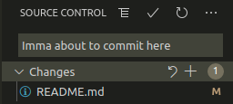

# DuckDuckWhaleUCSD's User Page

Rust is awesome!

Screenshots for commands and stuff:




# H1
## H2
### H3
#### H4
##### H5
###### H6

_italic_ _bold_ ~~strike~~ **_nested_**

> Quote

Inline `code`.

```
2
line
of
code
```

[Link to this page](https://duckduckwhaleucsd.github.io/)

Raw: <https://duckduckwhaleucsd.github.io/>

[Link to the readme](https://github.com/DuckDuckWhaleUCSD/duckduckwhaleucsd.github.io/blob/add-read-me/README.md)

- first
	- nested
- second

1. first
	- nested
2. second

- [ ] Task list
- [x] Done
